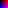

# **NPXL Images**
compact yet accessible image format used by my personal projects

`@nptnl` and `@notseanray`
#
### **the advantage**
When writing programs to generate images, formats with compression algorithms like PNG or JPG can be very difficult to work with, while the simple PPM format is very space-intensive and generally innefficient.

The NPXL improves upon the PPM format to remain easily and procedurally formatted while significantly cutting down storage space.

The PPM file is little more a list of numbers for each color value, but these values can be varying character lengths, and hence must be separated by spaces. NPXL allows more information to be encoded into a single character with hexadecimal and base-64, standardizing each color value to one character and eliminating the need for spacing.

Effectively, NPXL saves on space by encoding more information into each character and cutting space-characters in between.

## the .npxl format

Line 1: `{dimx} {dimy}`

- `{dimx}` and `{dimy}` indicate how many pixels wide and tall the image will be

Line 2: `{base}` `{colors}`

- `{base}` will be the base of the counting system, or one more than the maximum value for a character.
2 is binary,
16 is hexadecimal,
and 64 is base-64.
- `{colors}` decides how many values will be used for each pixel. If one value is used, that will corresdpond to the grayscale brightness of the pixel. Three values represent RGB, etc.

any further: `{data}`

- simply input all values in order.
- don't add any spaces between the characters, but break lines accordingly.

The idea here is to describe a brightness value with just one UTF-8 character, standardizing lengths in the process. This means not only will each value only use one character, but there will also not be space character in between.

---
## **grayscale example:**
*check the image `gray` in formats PNG, PPM, and NPXL in `./examples`*

```
32 8
16 1
0123456789abcdef0123456789abcdef
0123456789abcdef0123456789abcdef
0123456789abcdef0123456789abcdef
0123456789abcdef0123456789abcdef
0123456789abcdef0123456789abcdef
0123456789abcdef0123456789abcdef
0123456789abcdef0123456789abcdef
0123456789abcdef0123456789abcdef
```
This data corresponds to a 32x8 image with one base-16 character per pixel (making it grayscale).


---
## **color example:**
*check the image `color` in formats PNG, PPM, and NPXL in `./examples`*
```
8 8
16 3
000200400600800a00c00e00
002202402602802a02c02e02
004204404604804a04c04e04
006206406606806a06c06e06
008208408608808a08c08e08
00a20a40a60a80aa0ac0ae0a
00c20c40c60c80ca0cc0ce0c
00e20e40e60e80ea0ec0ee0e
```

This data corresponds to an 8x8 image with three base-16 characters per pixel (making it RGB).



---

To see the benefits of the format, open the PNG and PPM examples as text and note that NPXL manages to store the image efficiently without a cancerous format.

[Return to readme.md](./readme.md)