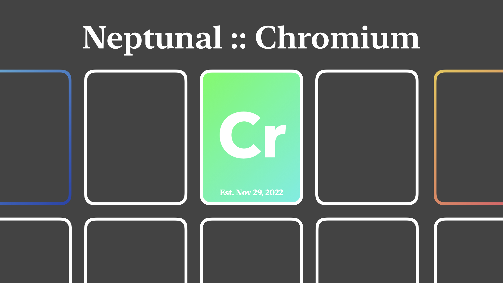

---

# **Chromium:** visualizing based math

Chromium is a personal Rust project designed to display a few **very cool** visual applications in mathematics using my math library, Ferrum.

The code may be ass, but I like ass.

I like it very much.

**We have:** *(so far)*

- Fatou and Mandelbrot set fractal rendering for the famous recursive formula z^2 + c

- Generalized input-space and parameter-space capability for rendering fractals with any recursive formula

- Line plotting for any whole start and end point

- 2D Coordinate type with rotation and reflection

- 3D Coordinate types that rotate about any axis and project to a 2D plane

- 2D and 3D wireframe type that can be used to connect a set of points in a predefined manner

- Writing into a custom image format, [NPXL](./npxl.md), for compact render storage

---

See my small math library that is the basis for this project at
[Ferrum](https://github.com/nptnl/ferrum),
and watch me attempt to use this math to create a calculator with user-input in
[Titanium](https://github.com/nptnl/titanium).